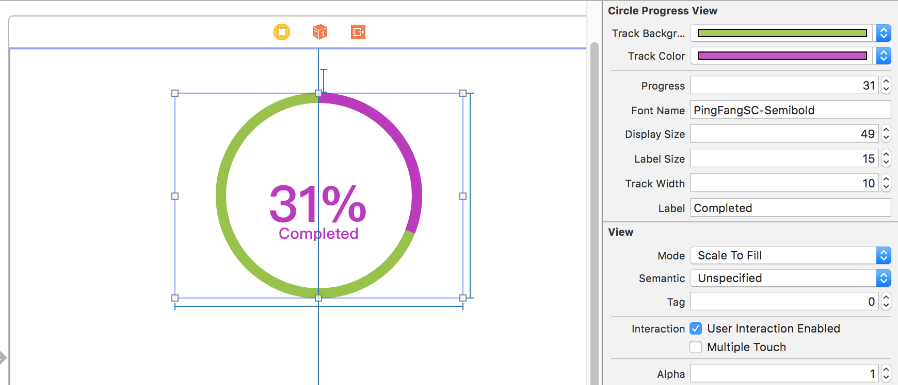

TICircleProgressView
====
Circular progress indicator that displays the progress from 0-100%.

Requirements
----
Xcode 8
swift 3

Usage
----
Copy TICircleProgress.swift into your project. Can be used with InterfaceBuilder or instantiated in code.

or 

pod init

```.podspec
target 'TICircleProgressView' do
# Comment this line if you're not using Swift and don't want to use dynamic frameworks
use_frameworks!

# Pods for TICircleProgressView
pod 'TICircleProgress', :git => 'https://github.com/toddisaacs/TICircleProgress.git', :tag => '1.0.0'
target 'TICircleProgressViewTests' do
inherit! :search_paths
# Pods for testing
end


post_install do |installer|
installer.pods_project.targets.each do |target|
target.build_configurations.each do |config|
config.build_settings['SWIFT_VERSION'] = '3.0'
end
end
end

end

```
Interface Builder


Code
```swift
import UIKit

class ViewController: UIViewController {

  @IBOutlet var circleProgressView: TICircleProgressView!

  @IBOutlet var slider: UISlider!

  let manualProgressView = TICircleProgressView(frame: CGRect(x: 20, y: 100, width: 100, height: 100))

  override func viewDidLoad() {
    super.viewDidLoad()
    slider.value = circleProgressView.progress

    manualProgressView.backgroundColor = UIColor.clearColor()
    manualProgressView.progress = slider.value
    manualProgressView.trackColor = UIColor.orangeColor()
    manualProgressView.trackBackgroundColor = UIColor.brownColor()
    manualProgressView.fontName = "BradleyHandITCTT-Bold"
    manualProgressView.label = "Tested"
    manualProgressView.trackWidth = 6
    manualProgressView.labelSize = 8
    manualProgressView.displaySize = 20

    view.addSubview(manualProgressView)

  }
```
 options
 - trackBackgroundColor
    - default (red:0.625, green:0.320, blue:0.320, alpha:1.0)
 - trackColor
    - default (red:0.797, green:0.320, blue:0.800, alpha:1.0)
 - progress (0-100)
 - fontName  - string name of an IOS font
 - displaySize  - font size of the numeric display
 - label - custom label below the numeric display
 - labelSize - font size of label

Fonts
----
http://iosfonts.com/
